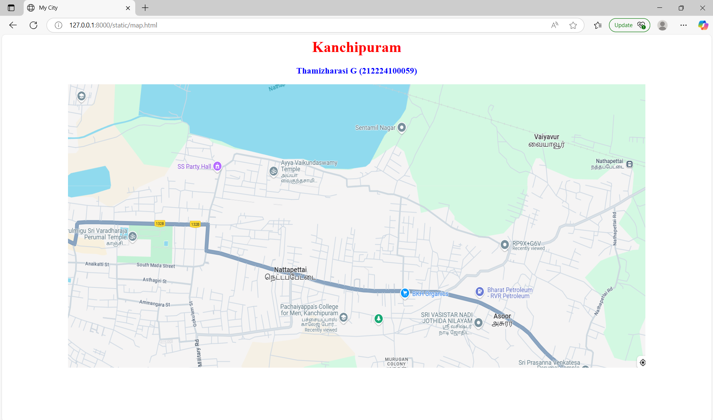
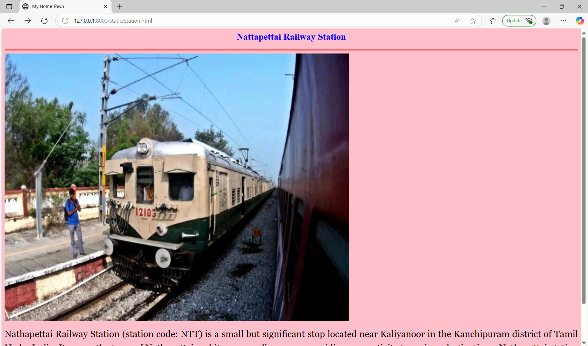
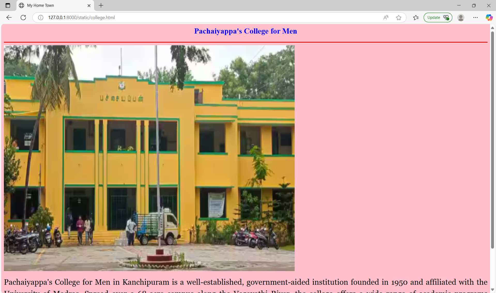
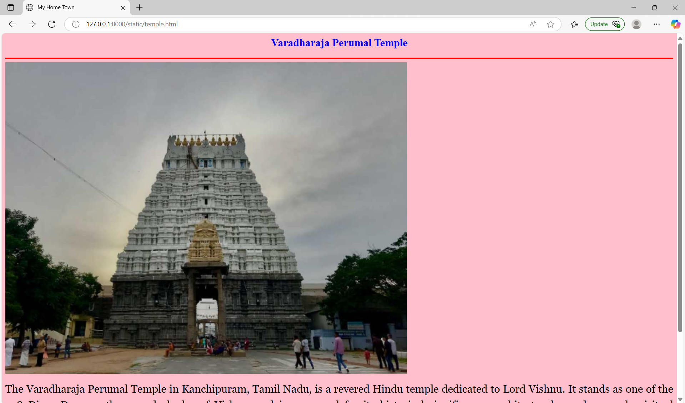
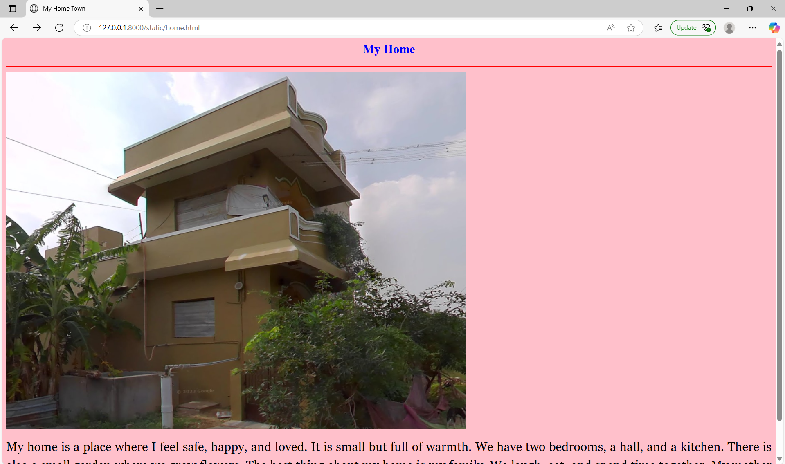
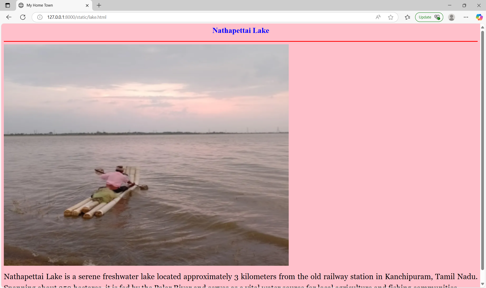

# Ex04 Places Around Me
# Date:03.05.2025
# AIM
To develop a website to display details about the places around my house.

# DESIGN STEPS
## STEP 1
Create a Django admin interface.

## STEP 2
Download your city map from Google.

## STEP 3
Using <map> tag name the map.

## STEP 4
Create clickable regions in the image using <area> tag.

## STEP 5
Write HTML programs for all the regions identified.

## STEP 6
Execute the programs and publish them.

# CODE
```
map.html

<html>
<head>
    <title>My City</title>
</head>
<body> 
    <h1 align="center"><font color="Red"><b>Kanchipuram</b></font></h1>
    <h3 align="center"><font color="blue"><b>Thamizharasi G (212224100059)</b></font></h3>
    <center>
        
        <map name="My Home Town">
            <area target="_blank" alt="Railway Station" title="Railway Station" href="station.html" coords="1705,209,1743,234" shape="rect">
            <area target="_blank" alt="Pachaiyappa's College" title="Pachaiyappa's College" href="college.html" coords="825,631,870,676" shape="rect">
            <area target="_blank" alt="Varadharaja Perumal Temple" title="Varadharaja Perumal Temple" href="temple.html" coords="172,407,219,449" shape="rect">
            <area target="_blank" alt="My Home" title="My Home" href="home.html" coords="1326,433,1359,474" shape="rect">
            <area target="_blank" alt="Nattapettai Lake" title="Nattapettai Lake" href="lake.html" coords="1033,4,227,4,221,73,334,93,415,137,520,173,618,195,723,208,821,230,926,220,1011,103" shape="poly">
        </map>
    </center>
</body>
</html>

station.html

<html>
    <head>
        <title>My Home Town</title>
    </head>
    <body bgcolor="pink">
        <h2 align="center">
            <font color="blue"><b>Nattapettai Railway Station</b></font>
        </h2>
        <hr size="3" color="red">
        
        <p align="justify" style="line-height: 1.5;">
            <font face="Georgia" size="5">
                    Nathapettai Railway Station (station code: NTT) is a small but significant stop located near Kaliyanoor in the Kanchipuram district of Tamil Nadu, India. It serves the town of Nathapettai and its surrounding areas, providing connectivity to various destinations. Nathapettai station is part of the Chennai Suburban Railway network, specifically on the South West Line that extends from Chennai Beach through Tambaram and Chengalpattu towards Arakkonam. It accommodates various types of trains.
            </font>
        </p>
    </body>
</html>

college.html

<html>
    <head>
        <title>
            My Home Town
        </title>
    </head>
    <body bgcolor="pink">
        <h2 align="center">
            <font color="blue"><b>Pachaiyappa's College for Men</b></font>
        </h2>
        <hr size="3" color="red">
        
        <p align="justify" style="line-height: 1.5;">
            <font face="Georgia" size="5">
            Pachaiyappa's College for Men in Kanchipuram is a well-established, government-aided institution founded in 1950 and affiliated with the University of Madras. Spread over a 68-acre campus along the Vegavathi River, the college offers a wide range of academic programs including undergraduate, postgraduate, and research courses in disciplines such as arts, science, commerce, and computer applications. It boasts modern facilities like advanced laboratories, a well-stocked library, computer centers, and sports amenities. The college also encourages student engagement through extracurricular activities including NCC, NSS, and various social service programs.  
            </font>      
        </p>
    </body>
</html>


temple.html

<html>
    <head>
        <title>My Home Town</title>
    </head>
    <body bgcolor="pink">
        <h2 align="center">
            <font color="blue"><b>Varadharaja Perumal Temple</b></font>
        </h2>
        <hr size="3" color="red">
        
        <p align="justify" style="line-height: 1.5;">
            <font face="Georgia" size="5">
                The Varadharaja Perumal Temple in Kanchipuram, Tamil Nadu, is a revered Hindu temple dedicated to Lord Vishnu. It stands as one of the 108 Divya Desams, the sacred abodes of Vishnu, and is renowned for its historical significance, architectural grandeur, and spiritual importance. The temple boasts a rich history with over 350 inscriptions from various dynasties, including the Cholas, Pandyas, Hoysalas, and Vijayanagara rulers. Originally renovated by the Cholas in 1053 CE, it underwent significant expansions during the reigns of Kulottunga Chola I and Vikrama Chola. Notably, during a Mughal invasion in 1688, the main deity was temporarily relocated to Udayarpalayam for safekeeping and was ceremoniously returned in 1710.
            </font>
        </p>
    </body>
</html>

home.html

<html>
    <head>
        <title>My Home Town</title>
    </head>
    <body bgcolor="pink">
        <h2 align="center">
            <font color="blue"><b>My Home</b></font>
        </h2>
        <hr size="3" color="red">
        
        <p align="justify" style="line-height: 1.5;">
            <font face="Georgia" size="5">
                My home is a place where I feel safe, happy, and loved. It is small but full of warmth. We have two bedrooms, a hall, and a kitchen. There is also a small garden where we grow flowers.

The best thing about my home is my family. We laugh, eat, and spend time together. My mother keeps everything clean, and my father tells us fun stories. I enjoy sitting on the balcony in the evening.
            </font>
        </p>
    </body>
</html>

lake.html

<html>
    <head>
        <title>My Home Town</title>
    </head>
    <body bgcolor="pink">
        <h2 align="center">
            <font color="blue"><b>Nathapettai Lake</b></font>
        </h2>
        <hr size="3" color="red">
        
        <p align="justify" style="line-height: 1.5;">
            <font face="Georgia" size="5">
                Nathapettai Lake is a serene freshwater lake located approximately 3 kilometers from the old railway station in Kanchipuram, Tamil Nadu. Spanning about 250 hectares, it is fed by the Palar River and serves as a vital water source for local agriculture and fishing communities.
            </font>
        </p>
    </body>
</html>
```
# OUTPUT






# RESULT
The program for implementing image maps using HTML is executed successfully.
